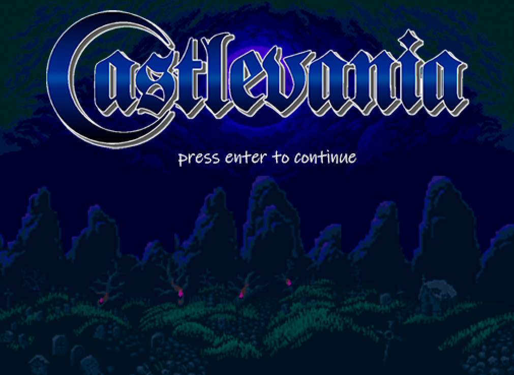
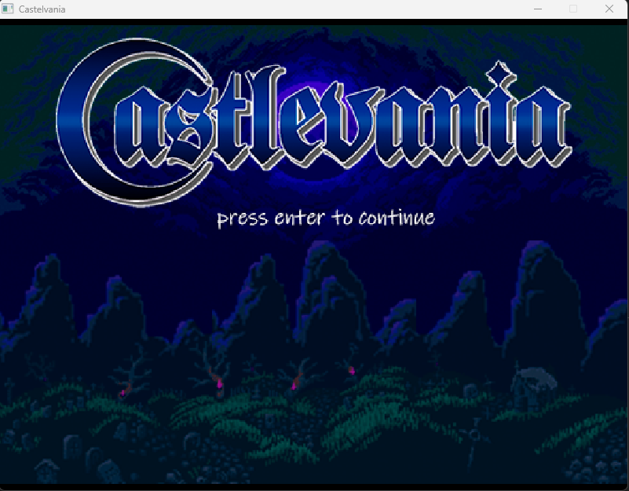
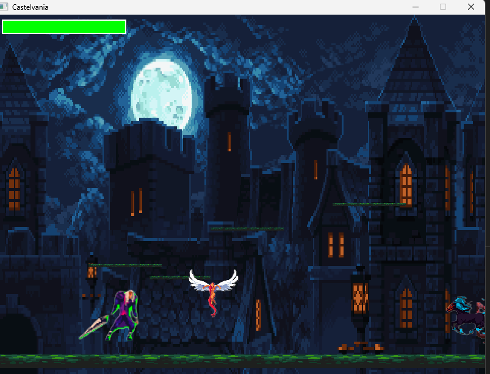
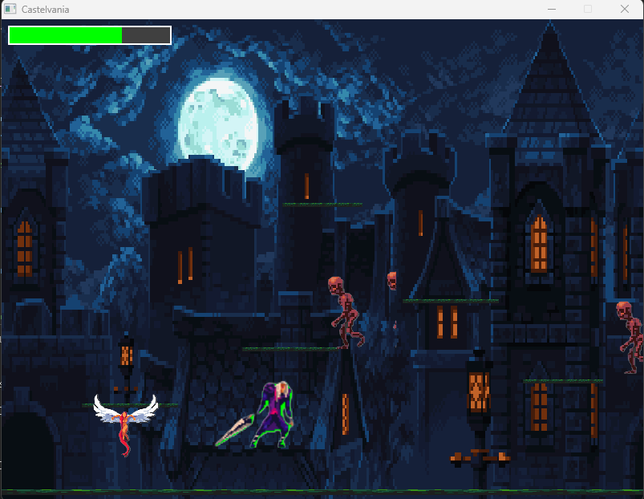
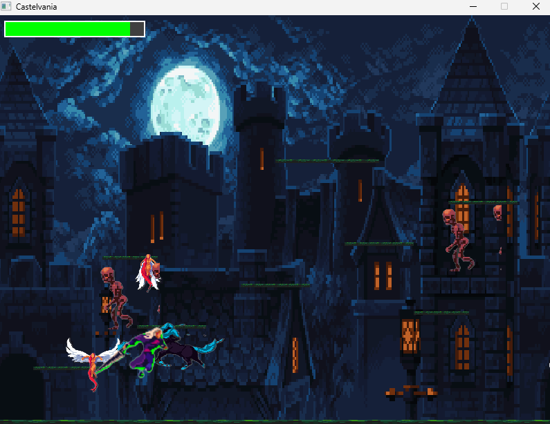

# Castelvania
# 🏰 CASTELVANIA
*Un juego de plataformas 2D inspirado en el clásico Castlevania*



## 📖 Descripción

Castelvania es un juego de plataformas desarrollado en C++ que combina acción, aventura y combate en un castillo lleno de criaturas sobrenaturales. El jugador debe atravesar tres niveles cada vez más desafiantes, enfrentándose a murciélagos, esqueletos y zombies con un sistema de física realista.

## 🎮 Screenshots del Juego

### Menú Principal


### Primer Nivel


### Segundo Nivel


### Tercer Nivel


## ✨ Características Principales

### 🎯 **Sistema de Combate Dinámico**
- Combate cuerpo a cuerpo con animaciones fluidas
- Sistema de salud para jugador y enemigos
- Efectos visuales de daño y estados hurt

### 🤖 **IA para enemigos**
- **Murciélagos**: IA de vuelo que persigue al jugador en 3D
- **Esqueletos**: Saltan obstáculos y persiguen agresivamente  
- **Zombies**: Movimiento persistente y patrullaje inteligente
- Los enemigos detectan al jugador dentro de un rango y adaptan su comportamiento

### ⚙️ **Físicas Realistas**
- Motor de físicas **Box2D** integrado
- Gravedad, colisiones y momentum realistas
- Plataformas físicas con diferentes materiales
- Detección precisa de suelo para saltos

### 🎨 **Sistema de Animación**
- Sprites animados para todos los personajes
- Estados de animación: idle, correr, atacar, saltar, daño
- Transiciones fluidas entre animaciones
- Diferentes velocidades de animación por personaje


## 🎮 Controles

| Tecla | Acción |
|-------|--------|
| **A** | Mover izquierda |
| **D** | Mover derecha |
| **W / Espacio** | Saltar |
| **Enter** | Atacar |
| **ESC** | Pausar/Menú |
| **R** | Reiniciar nivel |


## 🏗️ Compilación

### Requisitos
- **C++17** o superior
- **SFML 2.5+** - Para gráficos y audio
- **Box2D** - Para físicas
- **CMake** (opcional)


## 🚀 Ejecución

```bash
make run
```

**Nota**: Asegúrate de que la carpeta `assets/` esté en el mismo directorio que el ejecutable.

## 🎯 Mecánicas del Juego

### 💪 Sistema de Progresión
- **3 Niveles** con dificultad creciente
- Enemigos con diferentes comportamientos y estadísticas
- Sistema de puntuación basado en tiempo y eliminaciones

### 🏰 Niveles

| Nivel | Enemigos | Dificultad | Características |
|-------|----------|------------|-----------------|
| **1** | 3 enemigos básicos | ⭐⭐ | Plataformas introductorias |
| **2** | 5 enemigos variados | ⭐⭐⭐ | Plataformas complejas |
| **3** | 9 enemigos  | ⭐⭐⭐⭐⭐ | Laberinto de plataformas |

### 👾 Enemigos

#### 🦇 Murciélago
- **Salud**: 30 HP
- **Daño**: 10
- **Habilidad**: Vuelo libre, persigue en cualquier dirección
- **IA**: Detecta al jugador a 200px, vuela directamente hacia él

#### 💀 Esqueleto  
- **Salud**: 60 HP
- **Daño**: 20
- **Habilidad**: Salto para superar obstáculos
- **IA**: Persigue al jugador, salta cuando detecta desniveles

#### 🧟 Zombie
- **Salud**: 100 HP  
- **Daño**: 30
- **Habilidad**: Movimiento persistente, alta resistencia
- **IA**: Patrullaje constante, persigue tenazmente

## 🏗️ Arquitectura del Código

### 📁 Estructura de Archivos
```
CASTELVANIA/
├── src/
│   ├── Castelvania.cpp    # Punto de entrada principal
│   ├── CGame.*           # Lógica principal del juego
│   ├── CPlayer.*         # Clase del jugador
│   ├── CEnemy.*          # Sistema de enemigos con IA
│   ├── CLevel.*          # Gestión de niveles
│   └── CPhysics.*        # Motor de físicas Box2D
├── assets/               # Recursos gráficos
└── README.md
```

### 🔧 Clases Principales

#### `CGame`
- **Responsabilidad**: Loop principal, estados del juego, gestión de niveles
- **Características**: Manejo de eventos, renderizado, física global
- **Estados**: Menu, Playing, Paused, Game Over, Victory

#### `CPlayer`  
- **Responsabilidad**: Lógica del jugador, animaciones, físicas
- **Características**: 6 estados de animación, integración con Box2D
- **Sistema**: Salud (100 HP), velocidad configurable, salto físico

#### `CEnemy`
- **Responsabilidad**: IA de enemigos, comportamientos únicos
- **Características**: 3 tipos diferentes, detección de jugador, física individual
- **IA**: Algoritmos específicos por tipo de enemigo

#### `CLevel`
- **Responsabilidad**: Gestión de niveles, spawn de enemigos, plataformas
- **Características**: Plataformas físicas, fondos multicapa, spawn points

#### `CPhysics`
- **Responsabilidad**: Integración con Box2D, colisiones, físicas realistas
- **Características**: Gravedad configurable, categorías de colisión, contactos

## 🎨 Sistema de Sprites

### Jugador (Character.png)
```
Estados disponibles:
- IDLE: Frame estático de reposo
- RUN: 6 frames de animación de carrera  
- ATTACK: 4 frames de animación de ataque
- HURT: Frame de daño recibido
- JUMP/FALL: Frames de salto y caída
```

### Enemigos
- **murcielago.png**: 5 frames de vuelo
- **skeleton.png**: Idle + 5 frames de movimiento  
- **zombie.png**: Idle + 4 frames de movimiento

## ⚡ Optimizaciones Implementadas

### 🔧 Rendimiento
- **Pooling de objetos**: Reutilización de enemigos
- **Frustum culling**: Solo renderiza objetos visibles
- **Física optimizada**: 60 FPS estables con múltiples objetos

### 🧠 IA
- **Detección por distancia**: Los enemigos solo calculan IA cuando el jugador está cerca
- **Estados de comportamiento**: Cada enemigo tiene estados idle/chase/attack
- **Pathfinding básico**: Los enemigos evitan obstáculos simples

### 💾 Gestión de Memoria
- **Smart pointers**: Gestión automática de memoria
- **RAII**: Recursos liberados automáticamente
- **Minimal copying**: Referencias y movimientos para eficiencia

## 🐛 Debugging

El juego incluye un sistema robusto de debugging:

```cpp
// Información de físicas
player.printPhysicsStatus();

// Estado completo del juego  
game.debugFullPhysicsState();

// Información de enemigos
enemy.printStatus();
```

## 🔮 Futuras Mejoras

- [ ] **Sistema de audio** con SFML Audio
- [ ] **Más niveles** con mecánicas únicas
- [ ] **Power-ups** y mejoras del jugador
- [ ] **Jefes finales** con IA compleja
- [ ] **Modo multijugador** local
- [ ] **Editor de niveles** integrado

## 🤝 Contribuciones

¡Las contribuciones son bienvenidas! Por favor:

1. Fork el proyecto
2. Crea una rama para tu feature (`git checkout -b feature/AmazingFeature`)
3. Commit tus cambios (`git commit -m 'Add some AmazingFeature'`)
4. Push a la rama (`git push origin feature/AmazingFeature`)
5. Abre un Pull Request

## 📄 Licencia

Este proyecto está bajo la Licencia MIT - mira el archivo `LICENSE` para más detalles.

## 🙏 Reconocimientos

- **SFML** - Framework de multimedia
- **Box2D** - Motor de físicas 2D  
- **Castlevania** - Inspiración original de Konami
- Sprites y assets creados para el proyecto

---

**¡Disfruta explorando el castillo y enfrentando a las criaturas de la noche!** 🌙🏰